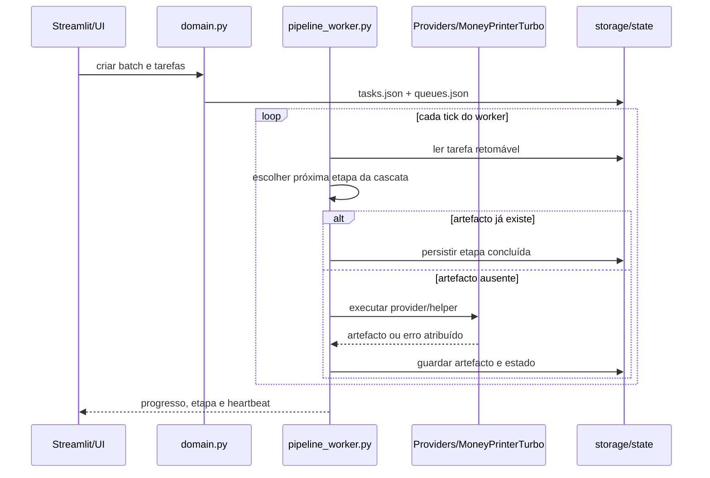
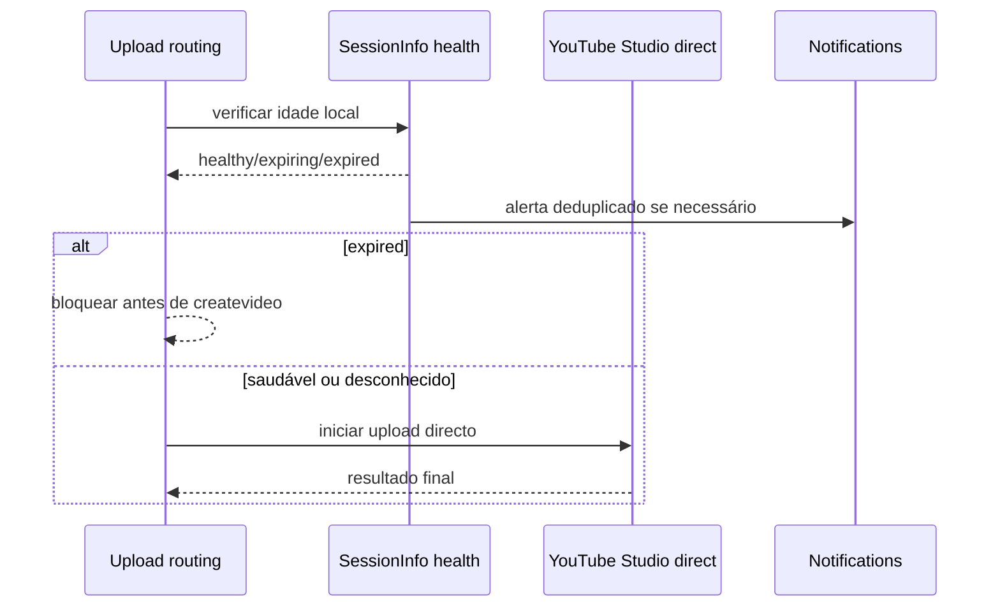

# API interna e fluxos de execução

Este documento descreve os contratos internos mais importantes do Thunderbolt para contribuidores e manutenção. A aplicação é uma interface Streamlit com workers locais; os módulos abaixo comunicam através de funções Python e ficheiros JSON persistidos em `storage/state/`.

> **Regra de segurança:** tokens, cookies, API keys e `sessionInfo` são valores de entrada usados apenas em memória. Os health checks e notificações expõem estado, idade estimada e instruções de renovação, nunca o segredo.

## Módulos e contratos

| Módulo | API interna | Responsabilidade | Persistência |
|---|---|---|---|
| `hermes_ui.storage` | `read_json`, `write_json`, `atomic_write` | Ler e guardar estado JSON de forma resiliente | `storage/state/*.json` |
| `hermes_ui.blueprints` | `save_generated_blueprint` | Guardar Blueprint e Branding gerados | `storage/blueprints/**/*.json` |
| `hermes_ui.domain` | `create_tasks_for_batch`, `update_task` | Criar tarefas e transições de estado | `tasks.json`, `queues.json` |
| `hermes_ui.pipeline_worker` | `run_once`, `run_worker`, `_run_task` | Executar a cascata retomável de criação | `tasks.json`, `pipeline_worker.json`, artefactos |
| `hermes_ui.automation_worker` | `run_once`, `run_worker` | Criar lotes agendados e monitorizar a sessão | `batches.json`, `automation_worker.json` |
| `integrations.session_info_health` | `health_check_session_info`, `check_all_accounts_session_info_health` | Estimar idade/expiração de `sessionInfo` sem chamada mutável | Estado em memória e notificações locais |
| `integrations.upload_routing` | `upload_with_default_route` | Escolher API oficial, Upload directo ou Postiz | `uploads.json`, logs e notificações |

## Escritas atómicas de JSON

`atomic_write(path, data)` cria um ficheiro temporário no mesmo directório, serializa o documento completo, faz `flush` e `fsync`, e só depois executa `os.replace`. Assim, uma interrupção durante a serialização não substitui o documento anterior por JSON truncado. O mesmo contrato é usado por `write_json`, pelos artefactos retomáveis do worker, pelo estado do routing e pelos manifestos de cortes.

Os escritores de Blueprints e Brandings também passam por `atomic_write`. O fluxo de importação da UI valida primeiro que a raiz é um objecto JSON e só depois substitui o destino. Ficheiros temporários são removidos no bloco `finally` quando a serialização falha.

## Health check de SessionInfo

A implementação não inventa um endpoint privado de validação do YouTube Studio e não executa um pedido mutável para testar credenciais. Ao guardar manualmente o token, `credentials.json` recebe `sessionInfoCapturedAt` em UTC. O estado estimado usa TTL configurável, limitado a **24–48 horas** e com valor padrão de 36 horas:

| Estado | Significado | Comportamento |
|---|---|---|
| `healthy` | O token está dentro da janela segura | O upload directo pode avançar |
| `expiring` | Faltam poucas horas para o TTL | A UI e os workers alertam para renovação manual |
| `expired` | O TTL foi ultrapassado | O Upload directo é bloqueado antes de criar a sessão |
| `unknown` | Existe token, mas não existe data de captura | A UI pede que o utilizador guarde novamente o token |
| `missing` | Não existe token | A conta fica incompleta |

O health check corre ao apresentar as contas Google, no worker de vídeos, no worker de automações e antes da rota de Upload directo. As notificações são deduplicadas por conta, estado e dia. A rota de API oficial não depende de `sessionInfo` e continua a ser tentada antes do mecanismo directo.

## Orquestrador em cascata

Cada tarefa nova recebe `orchestration.name = local-cascade`, a ordem `topic → script → title → keywords → video → thumbnail_prompt → thumbnail → upload`, a etapa actual, as etapas concluídas e um contador de transições. O worker mantém a regra idempotente: se um artefacto válido já existe, lê-o e avança; só chama o provider ou helper quando o artefacto está ausente.

Quando uma tarefa é interrompida, o estado e os artefactos permanecem em `tasks.json`. O próximo `run_once()` procura tarefas `to_do` ou `doing`, retoma a etapa persistida e não refaz roteiro, título, vídeo ou thumbnail já válidos. O estado `blocked` e `cancelled` interrompe a cascata; falhas são marcadas com a etapa e o provider atribuídos.

## Upload directo e SessionInfo

## Fontes e limites externos

O contrato público do YouTube documenta a API Data e o protocolo oficial de uploads resumíveis, mas não documenta o token privado `sessionInfo` usado pela rota Studio. Por isso o Thunderbolt trata a validade temporal como uma **estimativa preventiva**, mantendo o resultado da chamada real como autoridade final [1] [2]. A substituição atómica segue as primitivas POSIX/Python de substituição de ficheiros, com o ficheiro temporário no mesmo directório para preservar a operação de rename no mesmo filesystem [3].

## References

[1]: https://developers.google.com/youtube/v3/docs "YouTube Data API Reference"

[2]: https://developers.google.com/youtube/v3/guides/using_resumable_upload_protocol "YouTube resumable upload protocol"

[3]: https://docs.python.org/3/library/os.html#os.replace "Python os.replace"

## Azure Speech V2 segmentado

`seed/skills/azure_tts_chunked.py` aplica um orçamento interno de caracteres ajustado à taxa de fala. O limite não representa uma conversão exacta entre caracteres e duração; é uma margem conservadora para manter cada pedido de síntese muito abaixo dos 600000 ms documentados para real-time TTS. Cada segmento é tentado individualmente, o MP3 é concatenado por FFmpeg/pydub e o helper exige `AZURE_CHUNK_COUNT` e um ficheiro não vazio antes de prosseguir.

`seed/skills/mpt_agent.py` reconhece o marcador de voz Azure V2, prepara o áudio task-local e só passa `--custom-audio-file` depois da validação. Sem áudio segmentado confirmado, lança `SkillError` e não inicia a CLI upstream; portanto, o caminho monolítico não é usado como fallback. O manifesto `latest-result.json` e o `LOG_FILE` continuam disponíveis em falhas, sem guardar credenciais ou o texto do roteiro.

## Diagnóstico terminal do worker

`hermes_ui.pipeline_worker._terminal_helper_detail()` filtra linhas de arranque como `using existing project` e `updated configuration fields`, preservando as últimas linhas accionáveis, incluindo `MPT_ERROR`, progresso de segmentos e causas devolvidas pelo MoneyPrinterTurbo. O estado da tarefa guarda `video_helper_status` e `video_elapsed_seconds` durante a execução para a UI mostrar actividade real, em vez de parecer parada após a sincronização.

A sincronização de `config.toml` usa escrita temporária, `flush`, `fsync` e `os.replace`. Uma falha no replace mantém o TOML anterior intacto e elimina o temporário incompleto.

## Diagnóstico residual da etapa Vídeo — 0.3.78

`_terminal_helper_detail()` remove sucesso de validação Pexels, sincronização do projecto, `uv sync` e marcadores `TASK_DIR`/`LOG_FILE`/`RESULT_FILE` do resumo de falha. Dá prioridade a `MPT_ERROR`, `Traceback`, `Exception`, `failed`, `error`, `timeout`, `missing` e `invalid`, mantendo o output completo limitado no artefacto `video-diagnostics`.

O renderer do backlog não corta o erro a 240 caracteres: mostra um resumo até 700 caracteres e um expander com o texto não editável até ao limite seguro, mais os caminhos do log e do manifesto. `run_checked()` usa timeout de 15 minutos, devolve o tail seguro do `uv` em falha e emite confirmação quando a sincronização termina.
